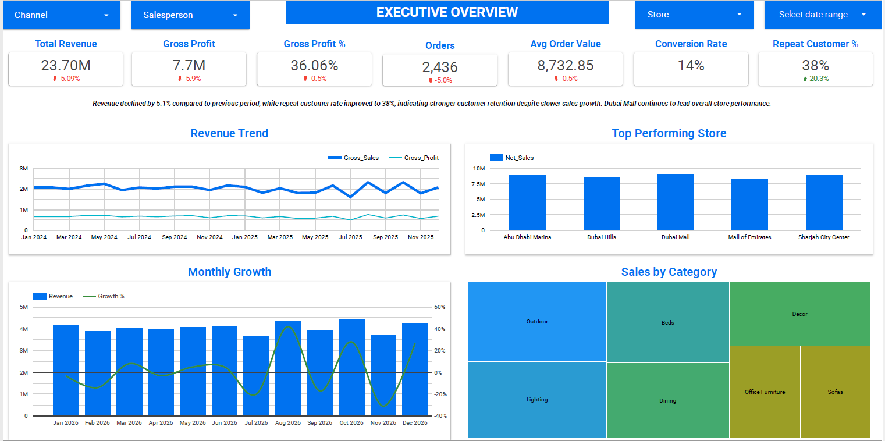
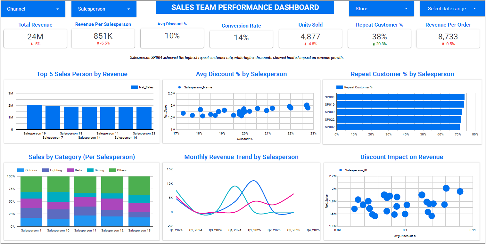
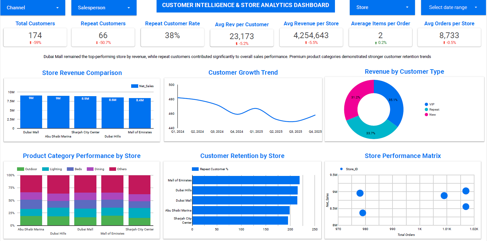
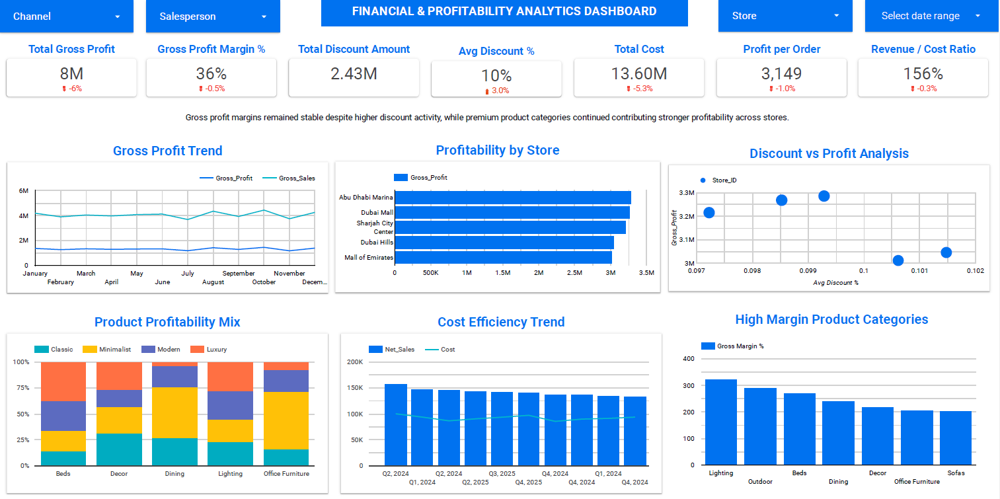

# Furniture Retail Sales Analytics Dashboard

## Overview

This project is an executive-level retail analytics solution developed in Looker Studio using Microsoft Excel as the primary data source.

The dashboard was designed to provide leadership teams with centralized visibility into sales performance, profitability, customer behavior, operational efficiency, and store-level performance across a multi-store furniture retail business.

The objective of this project was to transform fragmented retail sales data into a comprehensive business intelligence solution that supports faster, smarter, and more data-driven decision-making.

---

## Project Objectives

- Centralize retail performance reporting
- Improve executive visibility into sales and profitability
- Analyze customer retention trends
- Track store and salesperson performance
- Support data-driven strategic decisions
- Monitor operational and financial KPIs

---

## Business Problem

Retail organizations often face challenges such as:

- fragmented reporting across stores
- limited visibility into profitability
- difficulty tracking customer retention
- inconsistent sales performance analysis
- lack of centralized KPI monitoring
- limited operational insights for leadership teams

This dashboard was created to address these challenges through an interactive and executive-focused reporting solution.

---

## Tools & Technologies Used

- Looker Studio
- Microsoft Excel
- Data Blending
- Calculated Fields
- KPI & Performance Analytics
- Interactive Dashboard Filters
- Time-Series Trend Analysis
- Business Intelligence Reporting

---

## Skills Demonstrated

- Executive Dashboard Design
- KPI Development
- Business Performance Analysis
- Financial Analytics
- Data Storytelling
- Customer Analytics
- Data Visualization
- Looker Studio Development
- Analytical Problem Solving
- Business Intelligence Reporting

---

## Data Source

### Source Type
Microsoft Excel

### Data Includes

- Sales Transactions
- Store Information
- Customer Data
- Product Categories
- Salesperson Performance
- Revenue & Profitability Metrics

---

## Dashboard Modules

### Executive Overview Dashboard

Provides high-level visibility into:

- Revenue performance
- Gross profit analysis
- Monthly growth trends
- Store performance
- Product category contribution
- Customer retention metrics

---

### Sales Team Performance Dashboard

Focused on:

- Revenue by salesperson
- Discount impact analysis
- Conversion performance
- Repeat customer analysis
- Monthly sales trends

---

### Customer Intelligence & Store Analytics Dashboard

Focused on:

- Customer retention
- Store-level comparisons
- Customer growth trends
- Revenue segmentation
- Product performance by location

---

### Financial & Profitability Analytics Dashboard

Focused on:

- Gross profit trends
- Margin analysis
- Cost efficiency
- Product profitability mix
- Discount vs profit relationship

---

## Key KPIs Tracked

- Total Revenue
- Gross Profit
- Gross Profit Margin %
- Revenue Growth %
- Average Order Value
- Conversion Rate
- Repeat Customer Rate
- Revenue per Salesperson
- Revenue per Store
- Profit per Order
- Revenue / Cost Ratio
- Units Sold
- Customer Retention Metrics

---

## Techniques & Features Used

- Interactive dashboard filtering
- Cross-dashboard performance analysis
- Dynamic KPI reporting
- Time-series trend visualization
- Data blending in Looker Studio
- Calculated fields & custom metrics
- Profitability analysis
- Comparative store analysis
- Customer segmentation
- Sales performance benchmarking

---

## Sample Calculated Metrics

### Gross Profit Margin %

```text
Gross Profit / Revenue
```

### Average Order Value

```text
Revenue / Total Orders
```

### Revenue Growth %

```text
(Current Period Revenue - Previous Period Revenue) / Previous Period Revenue
```

### Repeat Customer Rate

```text
Repeat Customers / Total Customers
```

### Revenue per Salesperson

```text
Total Revenue / Number of Salespersons
```

---

## Key Insights

- Dubai Mall emerged as the highest-performing store by total revenue contribution.
- Repeat customer contribution remained strong despite slower sales growth trends.
- Premium product categories demonstrated stronger profitability and retention performance.
- Higher discount percentages showed limited impact on long-term revenue growth.
- Gross profit margins remained relatively stable across reporting periods.

---

## Business Impact

This solution demonstrates how business intelligence can help retail organizations:

- improve executive visibility
- monitor operational performance
- strengthen profitability analysis
- improve customer retention insights
- identify growth opportunities
- support strategic decision-making
- centralize KPI reporting

---

## Repository Structure

```text
furniture-retail-sales-analytics/
│
├── README.md
├── Furniture-Retail-Sales-Analytics-Dashboard.pdf
├── Furniture Sales Data.xlsx
│
├── screenshots/
│   ├── executive-overview.png
│   ├── sales-performance.png
│   ├── customer-analytics.png
│   └── profitability-dashboard.png
```

---

## Dashboard Preview

### Executive Overview Dashboard



---

### Sales Team Performance Dashboard



---

### Customer Intelligence & Store Analytics Dashboard



---

### Financial & Profitability Analytics Dashboard



---

## Repository Contents

- README.md
- Furniture Retail Sales Analytics Dashboard.pdf
- Furniture Sales Data.xlsx
- Dashboard Screenshots

---

## About This Project

This project is part of my growing portfolio focused on:

- Executive Business Intelligence
- Financial Analytics
- KPI & Performance Reporting
- Business Performance Transformation

Through Boardroom Insights, I aim to combine finance, strategy, and analytics into solutions that help businesses create clarity, visibility, and smarter decision-making.
